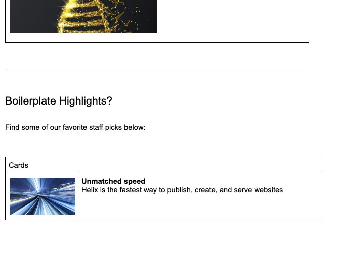
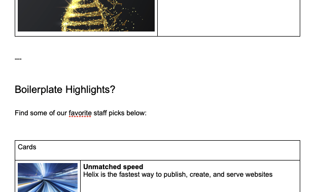
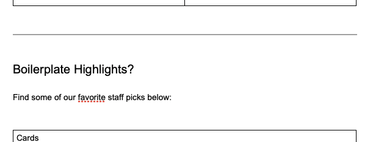

# adobe-docx-conv

## Problem Description

The application addresses a issue encountered when using the frontend technology [Adobe Franklin](https://aem.live/). Adobe Franklin enables the use of two different content sources to create a website:

- SharePoint (Word, Excel)
- Google Drive (Google Docs, Google Sheets)

In SharePoint, files are stored in .docx format, while in Google Drive they are in .gdoc format. A problem arises when attempting to transfer files from Google Drive to SharePoint.
Although Google allows exporting files to the .docx format, the exported files are not fully compatible with the .docx format used by Adobe Franklin on the SharePoint platform.

### First Problem

The first inconsistency is the way sections are separated in both formats. Adobe Franklin on Google Drive requires sections to be separated by a horizontal line, whereas SharePoint requires three dashes (---). This is further explained [here](https://www.aem.live/docs/authoring#sections).

#### Format Required by Google Drive



#### Format Required by SharePoint



#### Google Drive after Export to .docx - This File Cannot Be Used in SharePoint



### Second Problem

The second issue concerns the underlining of links. When exporting from Google Drive, all links are underlined; however, this underlining is unnecessary in SharePoint and often causes issues.

## Solution Description

Previously, all files had to be manually "repaired." Now, this application automates the process through a compiled program that is invoked with a parameter pointing to the file or folder that needs to be corrected. The parameter can be a single file, a folder, or a zip archive.
For folders or zip archives, the application recursively processes all files within and corrects them.
For individual files, the application only corrects that specific file.

### Usage Examples

NOTE: The application overwrites files; it does not create backups.

NOTE: The application has not been tested on Windows systems.

#### Linux/MacOS

```bash
./conv example/starter-content
./conv example/starter-content.zip
./conv example/index.docx
```

#### Windows

```bash
./conv.exe example/starter-content
./conv.exe example/starter-content.zip
./conv.exe example/index.docx
```

## Implementation Description

The application is written in GoLang, as it is a language that compiles to a binary file, making it fast and easy to distribute.
The docx library by nguyenthenguyen is used to edit Word files, allowing the application to open and modify .docx files.
